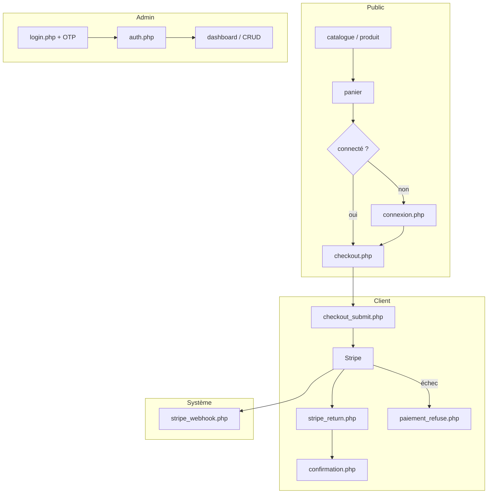

# CYNA Front — Guide d'installation

Application vitrine et espace client **PHP natif** (sans framework), avec back-office admin intégré.  
Ce dépôt front communique **directement avec MySQL** via PDO (`config/config.php`). Il est **distinct** de l’API Laravel **cyna-api** (déployée séparément sur Render — voir le `README.md` à la racine de ce dépôt API).

| Environnement | URL type |
|---------------|----------|
| Local (WAMP) | `http://localhost/Cyna_front/public/` |
| Production Render | `https://cyna-front.onrender.com/public/` |


---

## Sommaire

1. [Prérequis](#1-prérequis)
2. [Structure du projet](#2-structure-du-projet)
3. [Installation locale (WAMP / XAMPP)](#3-installation-locale-wamp--xampp)
4. [Configuration](#4-configuration)
5. [Base de données](#5-base-de-données)
6. [Stripe & webhooks](#6-stripe--webhooks)
7. [E-mail (inscription, admin 2FA)](#7-e-mail-inscription-admin-2fa)
8. [Démarrage & vérification](#8-démarrage--vérification)
9. [Authentification & protection des pages](#9-authentification--protection-des-pages)
10. [Catalogue des routes / pages](#10-catalogue-des-routes--pages)
11. [Relation avec cyna-api](#11-relation-avec-cyna-api)
12. [Dépannage](#13-dépannage)

---

## 1. Prérequis

| Outil | Version minimale | Usage |
|-------|------------------|-------|
| **PHP** | 8.1+ | Sessions, PDO, `curl`, `openssl`, `mbstring` |
| **MySQL** ou **MariaDB** | 8.0+ / 10.4+ | Schéma `cyna` |
| **Apache** | 2.4+ | Virtual host ou dossier `www` |
| **Composer** | 2.x | Dépendances (`stripe/stripe-php`, PHPMailer, etc.) |
| **Compte Stripe** | — | Paiements carte (mode test en dev) |
| **SMTP** (optionnel en dev) | — | Confirmation e-mail, reset mot de passe, OTP admin |

Extensions PHP recommandées : `pdo_mysql`, `curl`, `openssl`, `mbstring`, `json`, `session`.

---

## 2. Structure du projet

```
Cyna_front/
├── admin/              # Back-office (protégé admin + 2FA)
├── config/
│   ├── config.php      # Connexion MySQL (à personnaliser)
│   └── stripe_config.php
├── includes/           # Sessions, CSRF, i18n (lang.php)
├── public/             # Pages client & vitrine (point d’entrée web)
├── vendor/             # Composer (généré)
├── composer.json
└── index.php           # Redirection vers public/catalogue.php
```

**Point d’entrée web** : le dossier `public/` doit être servi par Apache (ou la racine du site doit rediriger vers `public/`).

---

## 3. Installation locale (WAMP / XAMPP)

### 3.1 Cloner ou copier le projet

```bash
# Exemple : placer le dossier dans le répertoire web WAMP
cd C:\wamp64\www
# git clone <url-repo-Cyna_front> Cyna_front
```

### 3.2 Installer les dépendances PHP

```bash
cd Cyna_front
composer install
```

### 3.3 Apache — accès aux URLs

Deux options courantes :

**Option A — URL avec sous-dossier**

- Racine projet : `C:\wamp64\www\Cyna_front`
- Vitrine : `http://localhost/Cyna_front/public/catalogue.php`
- Accueil : `http://localhost/Cyna_front/index.php` → redirige vers le catalogue
- Admin : `http://localhost/Cyna_front/admin/login.php`

**Option B — Virtual host (recommandé)**

```apache
<VirtualHost *:80>
    ServerName cyna.local
    DocumentRoot "C:/wamp64/www/Cyna_front/public"
    <Directory "C:/wamp64/www/Cyna_front/public">
        AllowOverride All
        Require all granted
    </Directory>
</VirtualHost>
```

Ajouter `127.0.0.1 cyna.local` dans `C:\Windows\System32\drivers\etc\hosts`, puis :

- Vitrine : `http://cyna.local/catalogue.php`
- Admin : configurer un alias `/admin` pointant vers `Cyna_front/admin/`

### 3.4 Droits d’écriture

Aucun stockage fichier massif côté front (images souvent via URL externes / Cloudinary côté API). Vérifier que PHP peut ouvrir des sessions (dossier temp système).

---

## 4. Configuration

### 4.1 Base de données — `config/config.php`

Créer ou adapter ce fichier (ne **jamais** committer de mots de passe réels) :

```php
<?php
$host     = '127.0.0.1';
$dbname   = 'cyna';
$username = 'root';          // ou utilisateur dédié
$password = '';              // mot de passe MySQL local

try {
    $connexion = new PDO(
        "mysql:host=$host;dbname=$dbname;charset=utf8mb4",
        $username,
        $password,
        [
            PDO::ATTR_ERRMODE            => PDO::ERRMODE_EXCEPTION,
            PDO::ATTR_DEFAULT_FETCH_MODE => PDO::FETCH_ASSOC,
        ]
    );
} catch (PDOException $e) {
    die('Erreur de connexion : ' . $e->getMessage());
}
```

### 4.2 Stripe — `config/stripe_config.php`

```php
<?php
define('STRIPE_SECRET_KEY',      'sk_test_...');   // Clé secrète Stripe
define('STRIPE_PUBLISHABLE_KEY', 'pk_test_...');   // Clé publique (checkout JS)
define('STRIPE_WEBHOOK_SECRET',  'whsec_...');    // Secret endpoint webhook
define('SITE_URL', 'http://localhost/Cyna_front/public'); // URL publique du front
```

> Adapter `SITE_URL` à votre URL locale ou Render. Les URLs de retour Stripe (`stripe_return.php`) et le webhook en dépendent.

### 4.3 Variables d’environnement Render (production)

Sur Render, configurer les mêmes valeurs via variables d’environnement ou fichiers de config injectés au déploiement (selon votre `render.yaml`). Ne pas exposer les clés dans le dépôt Git.

---

## 5. Base de données

1. Créer la base :

```sql
CREATE DATABASE cyna CHARACTER SET utf8mb4 COLLATE utf8mb4_unicode_ci;
```

2. Importer le schéma SQL fourni avec le projet (dump `cyna.sql` ou migrations équivalentes du dossier `database/` s’il existe).

3. Tables principales utilisées par le front :

| Table | Rôle | Données personnelles |
|-------|------|----------------------|
| `utilisateurs` | Comptes client + admin (`is_admin`) | Prénom, nom, e-mail, mot de passe hashé, tokens confirmation/reset |
| `products`, `categories` | Catalogue | Aucune donnée personnelle |
| `orders`, `order_items` | Commandes | Nom/adresse facturation, montants, 4 derniers chiffres carte |
| `user_addresses` | Adresses client | Adresses postales |
| `saved_cards` | Cartes enregistrées | Référence Stripe, 4 derniers chiffres (pas de PAN complet) |
| `promo_codes` | Codes promotionnels | Aucune donnée personnelle directe |
| `homepage_slides`, `homepage_content` | Contenu accueil | Aucune donnée personnelle |
| `chat_logs` | Historique chatbot | Messages, réponses, `session_id`, `utilisateur_id` optionnel |
| `contact_messages` | Formulaire contact | E-mail, sujet, contenu du message |

4. Compte admin initial : créer un utilisateur avec `is_admin = 1` et mot de passe hashé (`password_hash` PHP). La connexion admin exige ensuite un **code OTP à 6 chiffres** envoyé par e-mail.

---

## 6. Stripe & webhooks

| Élément | Valeur |
|---------|--------|
| Page retour client | `{SITE_URL}/stripe_return.php` |
| Page échec paiement | `{SITE_URL}/paiement_refuse.php` |
| Webhook serveur | `{SITE_URL}/stripe_webhook.php` |

Dans le [dashboard Stripe](https://dashboard.stripe.com/webhooks) :

- Événements : `payment_intent.succeeded`, `payment_intent.payment_failed`
- URL : `https://cyna-front.onrender.com/public/stripe_webhook.php` (prod)
- Copier le **signing secret** dans `STRIPE_WEBHOOK_SECRET`

Le webhook est **public** (pas de session) mais protégé par **signature Stripe** (`HTTP_STRIPE_SIGNATURE`).  


---

## 7. E-mail (inscription, admin 2FA)

| Flux | Page front | Données transitant par e-mail |
|------|-----------|-------------------------------|
| Confirmation d’inscription | `confirmer-email.php?token=` | Lien à usage unique (token hashé en base) |
| Mot de passe oublié | `reinitialiser_mot_de_passe.php` | Lien de reset (expiration ~60 min côté API) |
| Admin 2FA | `admin/login.php` | Code OTP 6 chiffres (15 min, 5 tentatives max côté API) |

Configurer SMTP dans les scripts concernés (`inscription.php`, `admin/login.php`, etc.) avec vos identifiants **hors dépôt Git**.

En développement, utiliser [Mailpit](https://github.com/axllent/mailpit), Mailtrap ou désactiver temporairement l’envoi pour tester l’UI.

---

## 8. Démarrage & vérification

```bash
# 1. Composer
composer install

# 2. Démarrer WAMP (Apache + MySQL)

# 3. Tester les URLs
#    - Catalogue : http://localhost/Cyna_front/public/catalogue.php
#    - Admin     : http://localhost/Cyna_front/admin/login.php
```

Checklist :

- [ ] Page catalogue s’affiche sans erreur PDO
- [ ] Inscription + connexion client (`est_confirme = 1` requis pour se connecter)
- [ ] Panier session (sans login)
- [ ] Checkout redirige vers connexion si non authentifié
- [ ] Admin : login → OTP e-mail → dashboard

---

## 9. Authentification & protection des pages

### Légende des accès

| Symbole | Signification |
|---------|---------------|
| **Public** | Accessible sans connexion |
| **Client** | Session `$_SESSION['utilisateur_id']` obligatoire |
| **Admin** | Session admin + `is_admin = 1` + OTP validé (`admin/auth.php`) |
| **Système** | Appel serveur (Stripe), pas d’UI utilisateur classique |
| **Action** | Endpoint POST/redirect ; pas une page de navigation directe |

### Client (espace utilisateur)

- Connexion : `public/connexion.php` — vérifie e-mail/mot de passe et **`est_confirme = 1`**
- Déconnexion : `public/deconnexion.php`
- Panier : stocké en **`$_SESSION['panier']`** — accessible sans login ; le paiement exige une connexion
- Redirection checkout : `connexion.php?redirect=checkout.php`

### Admin (back-office)

1. `admin/login.php` — identifiants admin + envoi OTP par e-mail  
2. Validation du code OTP (session temporaire)  
3. `admin/auth.php` — vérifie `$_SESSION['admin_id']` et `is_admin = 1` ; sinon → `login.php`  
4. Toutes les pages incluant `header.php` ou `auth.php` sont protégées

---

## 10. Catalogue des routes / pages

Les chemins sont relatifs à la racine du dépôt `Cyna_front/`.  
En production, préfixer par `/public/` pour la vitrine et `/admin/` pour le back-office.

### 10.1 Racine & vitrine (`public/`)

| Route (fichier) | Accès | Description | Données personnelles traitées |
|-----------------|-------|-------------|------------------------------|
| `index.php` | **Public** | Redirection vers le catalogue | Aucune |
| `public/catalogue.php` | **Public** | Liste des produits | Session technique uniquement |
| `public/produit.php?id=` | **Public** | Fiche produit | Session technique |
| `public/recherche.php` | **Public** | Recherche produits | Session technique |
| `public/a-propos.php` | **Public** | Page À propos | Aucune |
| `public/Contact.php` | **Public** | Contact + chatbot | E-mail, message, `chat_logs` |
| `public/Cgu.php` | **Public** | Conditions générales | Aucune |
| `public/mention_legales.php` | **Public** | Mentions légales + lien RGPD | Aucune |
| `public/inscription.php` | **Public** | Création de compte | Prénom, nom, e-mail, MDP hashé |
| `public/connexion.php` | **Public** | Connexion client | E-mail (MDP en transit) |
| `public/deconnexion.php` | **Client** (effet) | Détruit la session | Révocation session |
| `public/confirmer-email.php?token=` | **Public** | Activation compte | Token de vérification |
| `public/renvoyer_confirmation.php` | **Public** | Renvoi e-mail confirmation | E-mail |
| `public/mot_de_passe_oublie.php` | **Public** | Demande reset MDP | E-mail |
| `public/reinitialiser_mot_de_passe.php?token=` | **Public** | Nouveau MDP | Token + nouveau hash |
| `public/panier.php` | **Public** | Panier (session) | Contenu panier en session |
| `public/panier_add.php` | **Public** | **Action POST** — ajout panier | Session panier |
| `public/check_promo.php` | **Public** | **Action AJAX** — code promo | Aucune PII |
| `public/checkout.php` | **Client** | Formulaire commande | Nom, adresse facturation |
| `public/checkout_submit.php` | **Client** | **Action POST** — commande Stripe | Facturation, 4 derniers chiffres carte |
| `public/stripe_return.php` | **Client** | Retour 3D Secure | ID commande, session |
| `public/confirmation.php?order_id=` | **Client** | Succès commande | ID commande |
| `public/paiement_refuse.php` | **Public** | Échec paiement | Message d’erreur (pas de PII) |
| `public/stripe_webhook.php` | **Système** | Webhook Stripe | Métadonnées paiement Stripe |
| `public/mon-compte.php` | **Client** | Profil compte | Prénom, nom, e-mail, MDP |
| `public/mes-commandes.php` | **Client** | Historique commandes | Commandes liées au compte |
| `public/mes-abonnements.php` | **Client** | Abonnements actifs | Abonnements Stripe |
| `public/adresses.php` | **Client** | Adresses livraison | Adresses postales |
| `public/paiements.php` | **Client** | Cartes enregistrées | 4 derniers chiffres, ref. Stripe |

### 10.2 Back-office (`admin/`)

| Route (fichier) | Accès | Description | Données personnelles traitées |
|-----------------|-------|-------------|------------------------------|
| `admin/login.php` | **Public** | Connexion admin + OTP | Identifiants + code OTP |
| `admin/logout.php` | **Admin** (effet) | Déconnexion admin | Révocation session |
| `admin/index.php` | **Admin** | Tableau de bord | Agrégats anonymisés (CA, volumes) |
| `admin/categories.php` | **Admin** | Liste catégories | Aucune PII |
| `admin/category_save.php` | **Admin** | **Action** catégorie | Aucune PII |
| `admin/category_delete.php` | **Admin** | **Action** suppression | Aucune PII |
| `admin/products.php` | **Admin** | Liste produits | Aucune PII |
| `admin/product_edit.php` | **Admin** | Édition produit | Aucune PII |
| `admin/product_save.php` | **Admin** | **Action** produit | Aucune PII |
| `admin/product_delete.php` | **Admin** | **Action** suppression | Aucune PII |
| `admin/orders.php` | **Admin** | Liste commandes | Données clients commanditaires |
| `admin/order_view.php?id=` | **Admin** | Détail commande | Facturation client |
| `admin/users.php` | **Admin** | Gestion utilisateurs | Profils complets clients |
| `admin/promo_codes.php` | **Admin** | Codes promo | Aucune PII directe |
| `admin/slides.php` | **Admin** | Carrousel accueil | Aucune PII |
| `admin/slide_save.php` | **Admin** | **Action** slide | Aucune PII |
| `admin/slide_delete.php` | **Admin** | **Action** suppression | Aucune PII |
| `admin/home_text.php` | **Admin** | Textes homepage | Aucune PII |
| `admin/chat_logs.php` | **Admin** | Logs chatbot | Messages utilisateurs, session |

### 10.3 Schéma des flux principaux



---

## 11. Relation avec cyna-api

| Composant | Rôle |
|-----------|------|
| **Cyna_front** (ce projet) | UI PHP, MySQL PDO, sessions PHP, Stripe côté serveur front |
| **cyna-api** (Laravel) | API REST Sanctum, Cashier/Stripe, Supabase PostgreSQL, e-mails avec `FRONTEND_URL` |

En production CYNA :

- Front : `https://cyna-front.onrender.com`
- API : `https://cyna-api.onrender.com`

L’API Laravel pointe vers le front via `FRONTEND_URL` (liens e-mail vérification, reset password).  
**Ce dépôt front legacy** ne consomme pas l’API REST : il lit/écrit MySQL directement. Pour une architecture 100 % API :

- soit migrer le front vers des appels HTTP vers `cyna-api`,
- soit n’utiliser qu’une seule source de données (PostgreSQL Supabase via API uniquement).

Documenter clairement quel stack est actif dans votre environnement pour éviter une double base MySQL / PostgreSQL désynchronisée.

---


## 12. Dépannage

| Problème | Piste de résolution |
|----------|---------------------|
| `Erreur de connexion` PDO | Vérifier host, user, mot de passe, base `cyna` créée |
| Connexion refusée « compte non confirmé » | Valider le lien `confirmer-email.php` ou mettre `est_confirme = 1` en dev |
| Checkout redirige vers connexion | Normal si pas de `$_SESSION['utilisateur_id']` |
| Paiement OK mais commande `pending` | Vérifier webhook Stripe + `STRIPE_WEBHOOK_SECRET` |
| Admin boucle sur login | OTP expiré / SMTP non configuré ; vérifier sessions PHP |
| 404 sur `/public/` | Vérifier `DocumentRoot` ou chemin WAMP `www/Cyna_front` |
| CSRF / session perdue | Cookies, `session.save_path`, HTTPS en prod |
| Demande RGPD effacement compte | Front legacy : traiter via support ou API `DELETE /api/profile` |

